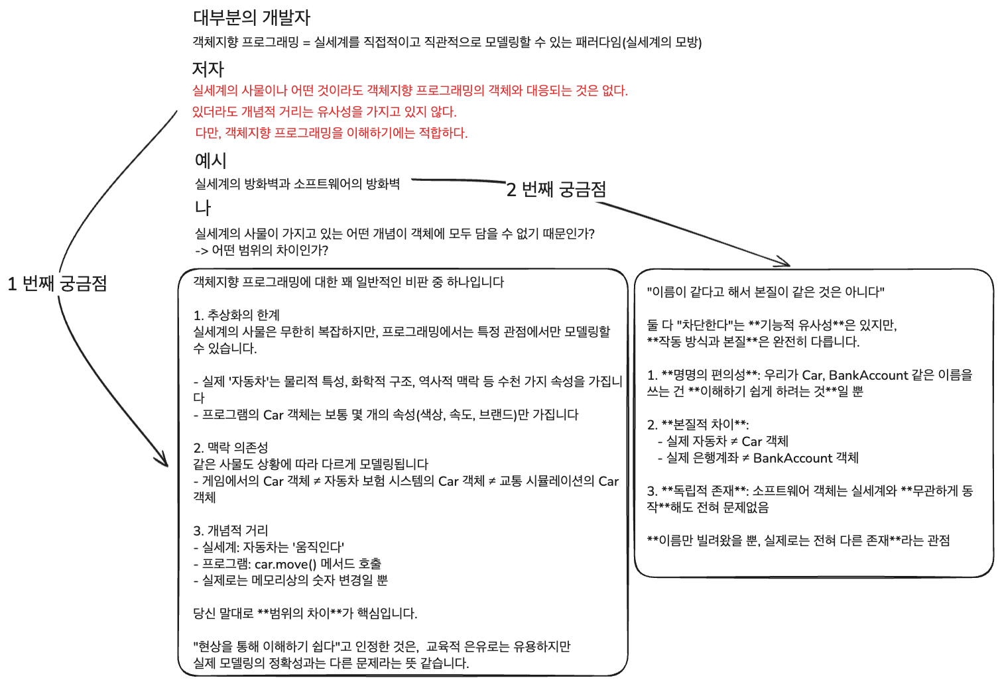
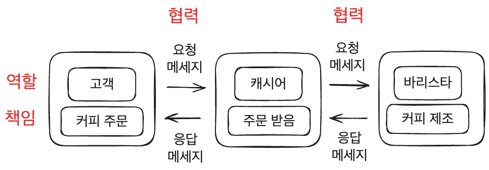
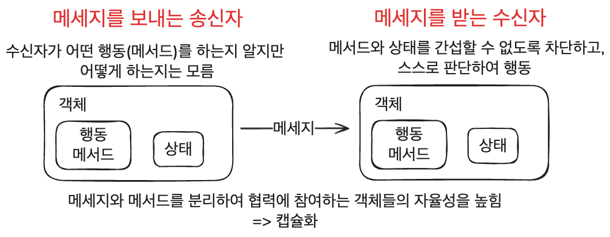
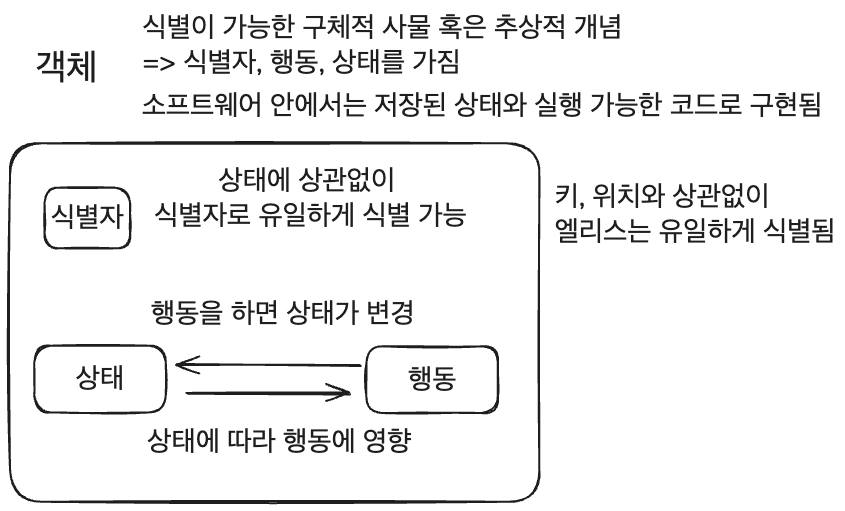
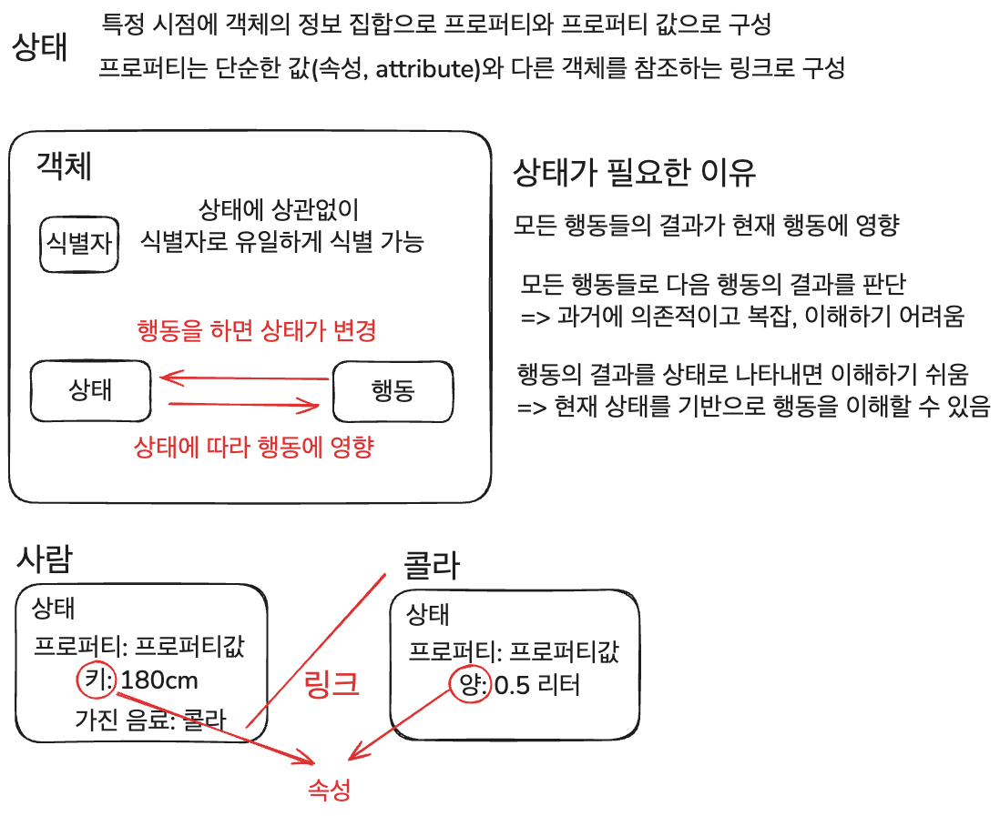
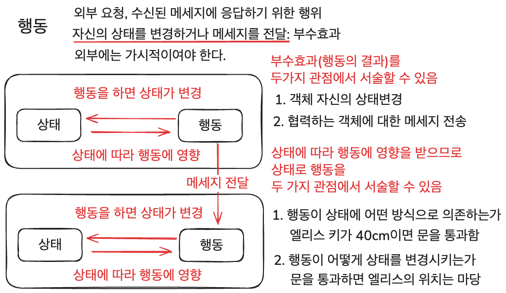
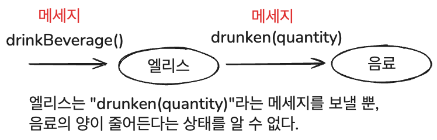

## 서문

객체지향의 특징

- 추상화, 캡슐화, 상속, 다형성: 다른 패러다임과 구분하는 차이점
- SOLID & 디자인 패턴

객체 지향을 이해하기 위한 방향

1. 클래스가 아닌 객체를 보라
2. 객체를 독립적인 존재가 아닌 기능을 구현하기 위해 협력하는 공동체의 존재로 보라
3. 협력에 참여하는 객체에 적절한 역할과 책임을 부여할 수 있는가
4. 이해한 개념들을 프로그래밍 언어에 담아낼 수 있는 기술 익히기

---

## 책의 구성

### 1. 협력하는 공동체

객체지향의 핵심은 자율적인 객체들의 협력

- 객체지향의 중심은 클래스가 아닌 객체

### 2. 이상한 나라의 객체

객체란 무엇인가

- 상태와 행동, 식별자를 가진 존재

### 3. 타입과 추상화

추상화 = 단순화

- 동적인 객체를 단순화해 정적인 타입으로 단순화

타입에 대한 설명과 객체를 클래스로 구현하는 이유

### 4. 역할, 책임, 협력

객체지향의 핵심인 역할, 책임, 협력에 대한 설명

### 5. 책임과 메세지 - 핵심

훌륭한 메세지 = 훌륭한 객체지향 설계의 기반

객체의 자율성과 설계의 유연성은 메세지에 달려있음

### 6. 객체 지도

객체지향이 구조와 기능을 조화시키는 방법

- 구조는 기능에 비해 변화에 안정적
- 구조 안에 기능을 녹임으로써 변화에 안정적인 소프트웨어 개발

도메인 모델과 객체지향 패러다임의 관계

---

## Chapter 1. 협력하는 공동체

- 객체지향 프로그래밍은 실세계의 모방이 아니다.

- 실세계와 객체지향

아래 표처럼 실세계와 객체 지향이 맵핑되는 특징으로

객체지향의 연결 완결성(Seamlessness)을 이해할 수 있음

| 실세계                                                      | 객체 지향 프로그래밍                                                    |
| ----------------------------------------------------------- | ----------------------------------------------------------------------- |
| **스스로 생각 & 결정**                                      | **상태와 행위를 캡슐화하는 자율성**                                     |
| 암묵적 약속 & 계약을 기반으로 협력하고 목표를 달성하는 과정 | 메세지를 주고 받으며 공동의 목표를 달성하기 위해 협력하는 객체들의 관계 |

### 실세계의 예시로 역할, 책임, 협력 이해하기

객체지향 프로그래밍의 세계는 `역할, 책임, 협력`으로 이해할 수 있다.

- 문제를 해결하기 위해 사람은 다른 사람와 협력을 함
- 사람은 역할과 역할에 대한 책임이 있음
- 사람은 요청과 응답을 통해 협력함

사람을 객체, 요청과 응답을 메세지, 요청을 처리하는 방법을 메서드라고 하면, 객체지향 프로그래밍을 이해할 수 있다.

또한, 역할을 맡고 역할에 적합한 책임을 수행한다는 것은 아래 4 가지 개념을 제시한다.

1. 여러 객체가 동일한 역할을 수행할 수 있음
2. 역할은 대체 가능성을 의미함

   여러 객체이 동일한 역할을 수행할 때,

   요청한 객체는 어떤 객체가 응답을 하던 문제가 생기지 않는다.

3. 책임을 수행하는 방법, 즉 메서드를 자율적으로 선택할 수 있음
4. 한 객체가 여러 역할을 수행할 수 있음

객체지향 프로그래밍의 주어진 문제인 애플리케이션의 기능을 구현하는 것은 아래처럼 생각할 수 있다.

1. 애플리케이션은 더 개념인 책임으로 분할됨
2. 책임은 적절한 역할을 가진 객체가 수행
3. 객체는 메세지를 통해 협력을 함

책임은 객체지향 설계의 품질을 결정하고, 역할은 유연하고 재사용 가능한 협력 관계를 구축한다.

---

### 협력하는 객체들의 공동체

아래 두 가지를 갖추어야 좋은 객체이다.

1. 충분히 협력적이여야 함

   외부의 도움없이 모든 것을 스스로 처리하는 God object는 내부 복잡도로 인해 자멸한다.

2. 충분히 자율적이여야 함

   다른 객체의 요청에 복종하지 않고 응답만 한다.

   즉, 자신의 원칙에 따라 스스로 동작해야 한다.

따라서, 다른 객체와 협력할 수 있도록 충분히 개방적이면서, 협력에 참여할 방법은 스스로 결정할큼 충분히 자율적이여야 한다.

---

### 상태, 행동 & 자율성

객체가 어떤 행동을 해야한다면 그 행동을 하는데 필요한 상태도 지녀야한다.

즉, 객체는 행동과 상태를 가지고 있다.

과거에는 데이터(상태)와 프로세스(행동, 메서드)를 엄격하게 구분했지만,

객체지향 프로그래밍은 데이터와 프로세스를 묶어 객체의 자율성을 보장한다.

가장 핵심적인 차이이며, 자율적인 객체로 이루어진 객체지향 프로그래밍은

유지보수가 쉽고 재사용이 용이한 시스템을 구축할 수 있는 가능성을 제시한다.

### 객체지향의 본질

- 객체지향은 시스템은 자율적인 객체들의 공동체이고 시스템을 객체를 이용해 분할하는 방법임
- 자율적인 객체는 상태와 행위를 지니고 스스로를 책임짐
- 객체는 협력을 하고 역할을 수행하며, 역할은 책임의 집합임
- 객체는 메세지로 협력하고 자율적으로 선택한 메서드로 처리함

또한 클래스는 객체를 담는 코드일 뿐, 클래스 구조와 메서드가 중요한 것이 아니라

객체의 역할, 책임, 협력에 집중해야한다.

### Chapter 요약

객체지향 프로그래밍은 객체의 역할, 책임, 협력으로 이해할 수 있고 이 것에 집중해야한다.

데이터와 프로세스를 구분한 과거의 방식과 다르게

객체는 행동과 상태를 가지고 있고, 때문에 자율성을 보장한다.

객체의 자율성이 가장 중요하며 메세지와 메서드의 분리로 자율성을 높힐 수 있다.

## Chapter 2. 이상한 나라의 객체

### 객체지향과 인지능력

사람은 세상을 객체의 집합으로 분해해서 바라보고 물질적, 추상적인 물체도 객체로 인지하는 능력이 있다.

이 인지 능력으로 객체지향 프로그래밍을 직관적이고 이해하기 쉬운 패러다임이라고 한다.

- 세상을 더 작은 객체로 분해하는 것은 세상의 복잡성을 극복하기 위함

실세계와 객체지향 프로그래밍의 공통점과 차이점은 아래와 같다.

- 객체로 이루워져있다는 것만 실세계와 유사함
- 객체지향 프로그래밍의 목적은 실세계 모방이 아닌 실세계를 기반으로 새로운 세계를 창조하는 것
- 현실의 전등은 불을 스스로 끄고 킬 수 없지만, 주문 객체는 스스로 계산을 한다.

### 객체

### 상태

객체는 자율적인 존재이므로 다른 객체의 상태에 직접적으로 접근, 변경할 수 없다.

즉, 객체 스스로의 행동으로만 상태를 변경할 수 있고 이 법칙은 객체의 자율성을 보장한다.

### 행동

### 상태 캡슐화

실세계의 객체와 중요한 차이점은 자율성이다.

실세계의 엘리스는 스스로 음료를 마시는 능동적인 존재이고,

음료는 아무것도 할 수 없는 수동적인 존재이다.

즉, 음료의 상태를 변경하는 주체가 엘리스이다.

하지만 객체지향 프로그래밍은 실세계와 아래처럼 다르다.

객체의 행동은 메세지가 유발하지만, 객체의 상태는 스스로 결정한다.

객체의 상태를 노출시키지 않고 행동을 경계로 캡슐화하는 것은

객체의 자율성을 높히고 협력을 단순하고 유연하게 만든다.

### 식별자

객체란 인지 능력을 이용해 식별 가능한 경계를 가진 모든 사물을 의미하므로 객체를 구별할 수 있는 프로퍼티가 존재한다.

이를 식별자라고 한다.

"모든 객체는 식별자를 가진다"는 말은 "객체가 아닌 단순한 값은 식별자를 가지지 않는다"는 말이다.

| 값                                                  | 객체                          |
| --------------------------------------------------- | ----------------------------- |
| 숫자, 문자열, 날짜, 시간 등 변하지 않는 양을 모델링 | -                             |
| 상태는 불변                                         | 행동, 시간에 따라 상태는 가변 |
| 불변이므로 상태가 같다면 같은 인스턴스              | 상태가 같아도 다른 객체       |

- 동등성(Equality): 상태를 이용해 두 값이 같은지 판단할 수 있는 성질
- 동일성(Identical): 식별자를 기반으로 객체가 같은지 판단할 수 있는 성질

식별자의 정의는 다음과 같다.

    어떤 객체와 구분하는데 사용하는 객체의 프로퍼티

    객체는 상태가 변경될 수 있으므로 식별자를 통한 동일성 검사로 두 인스턴스를 비교할 수 있다.

프로그래밍에서는 Integer, Person 모두 클래스에서 생성된 객체이므로 혼란이 온다.

따라서 아래와 같이 용어를 정리한다.

- 참조 객체(Reference object), 엔티티(Entity): 식별자를 지닌 객체
- 값 객체(Value object): 식별자를 가지지 않는 값

### Query와 Command

- Query: 객체의 상태를 조회하는 작업
- Command(명령): 객체의 상태를 변경하는 작업

### 행동이 상태를 결정한다.(중요)

행동에 초점을 맞춰야하는 이유는 아래와 같다.

1. 상태를 먼저 결정할 경우, 캡슐화가 저해됨

   공용 인터페이스에 상태가 그대로 노출될 확률이 높다.

2. 객체를 고립된 섬으로 만듬

   애플리케이션의 문맥 내에서 협력하기 위해 객체가 필요하지만,

   상태를 먼저 고려하면 문맥과 멀어진다.

3. 객체의 재사용성이 저하됨

   재활용성은 다양한 협력에 참여할 수 있는 능력에서 온다.

   상태에 초점을 맞추면 다양한 협력이 어렵다.

행동은 객체가 협력에 참여하는 유일한 방법이므로 객체가 적합한지는 상태보다는 행동에 의해 결정된다.

책임-주도 설계(Responsibility-Driven Design, RDD)에 대해 알아볼 예정이다.

- 행동은 협력에 참여하면서 완수해야할 책임을 의미하기도 함
- 어떤 책임이 필요한가 결정하는 과정이 전체 설계를 주도해야 함

### 은유와 객체

객체지향을 실세계의 모방으로 보는 관점은

객체지향 분석/설계란 실세계의 객체를 모방한 후, 필요 부분만 취해 소프트웨어 객체로 구현하는 과정,

즉, 현실세계의 추상화라고 한다.

- 추상화: 실제 사물에서 원하는 특성만 취하고 필요 없는 부분을 추려 핵심만 표현하는 행위

객체지향 프로그래밍을 실세계의 모방으로 봐서는 안 된다.

실세계 속 객체와 소프트웨어 객체의 가장 큰 차이점은 실세계 속에서 수동적인 객체가

소프트웨어 객체로 구현되면 능동적으로 변하는 점이다.

이 차이점이 소프트웨어 객체의 특징 중 의인화이다.

- 의인화: 실세계보다 더 많은 일을 할 수 있다는 특징

실세계를 통해서 객체지향 프로그래밍을 이해하고 경험할 수 있다.

즉, 실세계와 객체지향 프로그래밍의 관계는 은유 관계라고 표현할 수 있다.

- 은유: 실제로는 적용되지 않는 한 가지 개념을 이용해 다른 개념을 서술하는 대화의 형태

실세계 객체의 은유를 효과적으로 사용하면, 소프트웨어 객체와 표현적 차이를 줄일 수 있다.

- 소프트웨어에 대한 사람들의 생각과 실제 소프트웨어 사이의 차이

예시로, 실세계 객체의 이름을 소프트웨어 객체의 이름으로 붙히라고 가이드를 한다.

객체지향 프로그래밍의 목적은 실세계의 모방이 아니다.

소프트웨어 객체의 특성을 떠올릴 수 있다면, 실세계 객체의 이름을 이용하는 것이 좋겠지만,

굳이 그러지 않고 자유롭게 새로운 세계를 창조해도 괜찮다.

### Chapter 요약

객체와 그 구성요소인 상태, 행동, 식별자에 대해 정의했다.

또 실세계로 객체지향 프로그래밍을 은유하기에는 적합하지만,

절대로 객체지향 프로그래밍은 실세계의 모방이 아니다.

행동으로 객체를 설계해야한다고 강조하였다.
