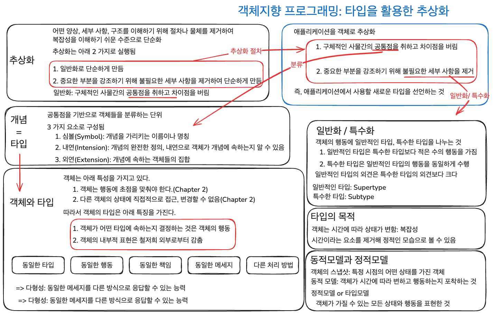
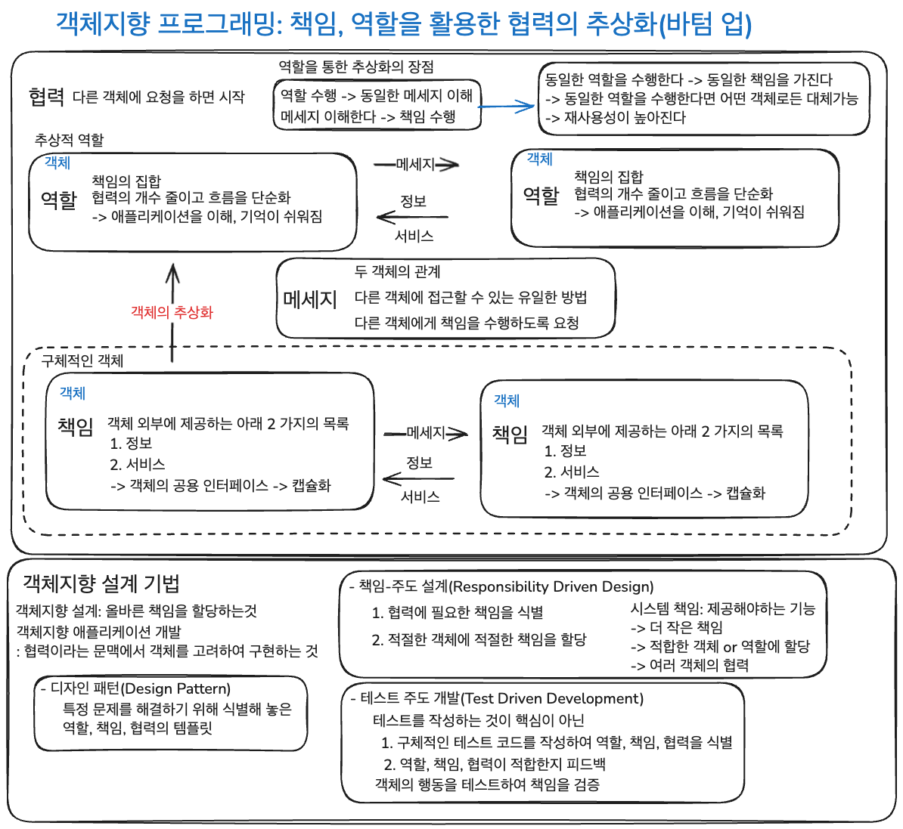

## Chapter 3. 타입과 추상화

추상화는 2 가지 절차가 있음

1. 구체적인 사물간의 공통점을 취하고 차이점을 버림

   - 분류

2. 중요한 부분을 강조하기 위해 세부 사항을 제거하여 단순하게 만듬

   - 일반화/특수화

객체지향 프로그래밍: 타입을 활용한 추상화

타입을 사용하는 이유

- 객체는 시간에 따라 상태가 변함
- 타입을 통해 시간이라는 요소를 제거하여 정적인 모습으로 복잡성을 해소

### Chapter 요약

객체지향은 타입을 사용해서 추상화를 하여 애플리케이션을 단순화한다.

분류, 일반화/특수화를 통해서 추상화를 한다.

### 질문

1. 시간에 따라 변하지 않는 상태를 정의하는 것은 옳은가?
2. 객체가 여러 개념을 가지면 올바른 설계를 한 것인가?
3. 여러 Supertype 가지는 Subtype은 올바르게 설계된 것인가?

## Chapter 4. 역할, 책임, 협력

책임을 식별하므로써 객체의 행동을 정의하고 책임의 집합인 역할로 객체를 추상화하여

협력을 더 단순화할 수 있다.

역할은 단순히 책임의 집합이 아니라, 객체가 대체될 수 있는 이유이다.

객체지향 설계가 다양한 객체가 동일한 협력에 참여할 수 있는 재사용성을 가지게된다.

## Chapter 요약

책임, 역할, 협력의 관점에서 객체지향 설계를 리마인드

역할을 통해서 추상화하여 협력을 단순화할 수 있다(바텀 업)
